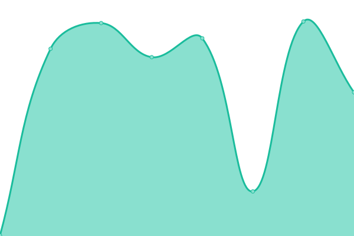

# [📈 Live Status](https://erikseguin.github.io/upptime): <!--live status--> **🟧 Partial outage**

This repository contains the open-source uptime monitor and status page for [Erik Séguin](https://erikseguin.github.io/upptime), powered by [Upptime](https://github.com/upptime/upptime).

With [Upptime](https://upptime.js.org), you can get your own unlimited and free uptime monitor and status page, powered entirely by a GitHub repository. We use [Issues](https://github.com/erikseguin/upptime/issues) as incident reports, [Actions](https://github.com/erikseguin/upptime/actions) as uptime monitors, and [Pages](https://erikseguin.github.io/upptime) for the status page.

<!--start: status pages-->
<!-- This summary is generated by Upptime (https://github.com/upptime/upptime) -->
<!-- Do not edit this manually, your changes will be overwritten -->
<!-- prettier-ignore -->
| URL | Status | History | Response Time | Uptime |
| --- | ------ | ------- | ------------- | ------ |
|  [Fake.Wang](https://fake.wang) | 🟩 Up | [fake-wang.yml](https://github.com/erikseguin/upptime/commits/HEAD/history/fake-wang.yml) | 

 483ms
     
 | 

<a href="https://status.fake.wang/history/fake-wang">100.00%</a>
    

|  [Jellyfin](https://jellyfin.fake.wang) | 🟩 Up | [jellyfin.yml](https://github.com/erikseguin/upptime/commits/HEAD/history/jellyfin.yml) | 

 456ms
     
 | 

<a href="https://status.fake.wang/history/jellyfin">100.00%</a>
    

|  [Jellyseerr](https://jellyseerr.fake.wang) | 🟩 Up | [jellyseerr.yml](https://github.com/erikseguin/upptime/commits/HEAD/history/jellyseerr.yml) | 

 656ms
     
 | 

<a href="https://status.fake.wang/history/jellyseerr">100.00%</a>
    

|  [Wizarr](https://wizarr.fake.wang) | 🟥 Down | [wizarr.yml](https://github.com/erikseguin/upptime/commits/HEAD/history/wizarr.yml) | 

 501ms
     
 | 

<a href="https://status.fake.wang/history/wizarr">90.40%</a>
    

|  [Grafana](https://grafana.fake.wang) | 🟩 Up | [grafana.yml](https://github.com/erikseguin/upptime/commits/HEAD/history/grafana.yml) | 

 398ms
     
 | 

<a href="https://status.fake.wang/history/grafana">100.00%</a>
    

<!--end: status pages-->

[**Visit our status website →**](https://erikseguin.github.io/upptime)

## 📄 License

- Powered by: [Upptime](https://github.com/upptime/upptime)
- Code: [MIT](./LICENSE) © [Erik Séguin](https://erikseguin.github.io/upptime)
- Data in the `./history` directory: [Open Database License](https://opendatacommons.org/licenses/odbl/1-0/)
